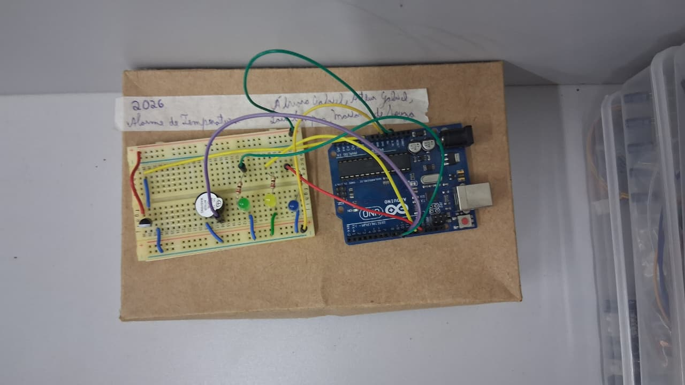

# 🌡️ Sistema de Monitoramento Térmico com Alerta Dual (Visual e Sonoro)

Sistema embarcado para aquisição e monitoramento de temperatura em tempo real com controle não-bloqueante de alertas visuais (LEDs) e sonoro (Buzzer). Desenvolvido para prevenção de falhas térmicas em ambientes críticos como CPDs, estufas e cadeia de frio.

---

## 📌 Funcionalidades

- **Leitura contínua de temperatura:** Transdução linear via sensor analógico LM35.
- **Sinalização Visual Redundante:**
  - 🟢 **LED Verde:** Estado Seguro ($\le 30.0\,^{\circ}\text{C}$)
  - 🟡 **LED Amarelo:** Estado de Atenção ($30.0\,^{\circ}\text{C} < T \le 40.0\,^{\circ}\text{C}$)
  - 🔵 **LED Azul:** Estado Crítico ($> 40.0\,^{\circ}\text{C}$)
- **Alerta Sonoro Temporizado Não-Bloqueante:** O buzzer liga por exatamente 5 segundos ao atingir o estado crítico sem interromper o loop principal ou congelar a leitura dos dados (`millis()`).
- **Filtragem de Ruído (Debouncing):** Intervalo de amostragem ajustado em 500 ms para estabilização de leituras no conversor ADC.

---

## 🛠️ Componentes e Materiais

| Item | Componente | Quantidade | Função |
| :--- | :--- | :---: | :--- |
| 1 | Arduino Uno R3 | 1 u | Processamento lógico e conversão ADC |
| 2 | Sensor de Temperatura LM35 | 1 u | Transdutor analógico ($10\,\text{mV}/^{\circ}\text{C}$) |
| 3 | LED Verde | 1 u | Indicador de Estado Seguro |
| 4 | LED Amarelo | 1 u | Indicador de Estado de Atenção |
| 5 | LED Azul | 1 u | Indicador de Estado Crítico |
| 6 | Resistores de 220 $\Omega$ | 3 u | Limitação de corrente para os LEDs |
| 7 | Buzzer Piezoelétrico | 1 u | Alerta acústico |
| 8 | Protoboard e Jumpers | 1 u | Infraestrutura de conexões elétricas |

---

## 🔌 Mapeamento de Pinos e Circuito

| Componente | Pino do Arduino | Função |
| :--- | :--- | :--- |
| **LM35 (Vout)** | `A0` | Entrada Analógica |
| **LED Verde** | `D9` | Saída Digital |
| **LED Amarelo** | `D12` | Saída Digital |
| **LED Azul** | `D13` | Saída Digital |
| **Buzzer** | `D10` | Saída PWM / Digital |

  

---

## 📐 Modelagem Matemática (ADC para Celsius)

O conversor analógico-digital (ADC) de 10 bits quantiza o sinal de $0\text{V}$ a $5\text{V}$ em valores de $0$ a $1023$. A conversão para milivolts e posteriormente para graus Celsius segue as equações:

$$V_{\text{mV}} = \left( \frac{\text{leituraAdc}}{1023} \right) \times 5000$$

$$T (^{\circ}\text{C}) = \frac{V_{\text{mV}}}{10}$$

---

## 🚀 Como Executar o Projeto

1. Baixe e instale a [Arduino IDE](https://www.arduino.cc/en/software).
2. Conecte a placa Arduino Uno ao computador via cabo USB.
3. Monte o circuito conforme a tabela de pinagem informada acima.
4. Abra o arquivo `Main.ino` na Arduino IDE.
5. Selecione a placa **Arduino Uno** e a **Porta COM** correspondente em *Ferramentas*.
6. Clique em **Carregar** (*Upload*).
7. Abra o **Monitor Serial** (`CTRL + SHIFT + M`) ajustado para **9600 baud** para visualizar as leituras térmicas em tempo real.

---

## 👥 Autores

- Álvaro Gabriel Avelar
- Arthur Gabriel Lodi
- Lara Vitória de Souza Campos
- Mariana de Sousa
